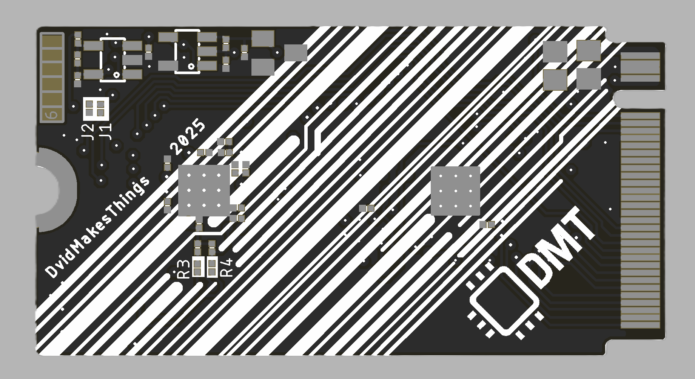

# BladeCore-M40

BladeCore-M40 is a versatile 6-layer embedded system module built around the RP2040 microcontroller, designed for modularity and high-speed experimentation in constrained spaces.  
It uses an M.2 form factor and includes a carefully routed, length-matched 16MB QSPI flash capable of operating at full 133 MHz quad I/O speeds — theoretically up to 532 Mbps effective throughput.  

The module provides optional breakouts for ADC, I²C, UART, GPIO, and USB signals — configurable based on application needs. Core voltage is externally adjustable via a trimpot-controlled LDO (AP7335-WG-7), enabling safe overclocking without risk of oversupply.  

USB routing is dynamically switchable using the PI3USB102J, allowing the single USB-C port to connect either to the MCU or to an FT232RNQ interface for debug automation.  
Boot/reset are handled programmatically; no physical boot/reset buttons are needed.  

It also includes:
- a high-precision 3.0 V analog reference supply (AVDD),
- a unique-ID EEPROM for per-module identification,
- and default configurations that favor RP2040-based development while leaving everything else adaptable.

BladeCore-M40 is not locked into any specific use case — it is meant to be reconfigured as needed.

---

## Highlights

- **RP2040 MCU** with external core voltage supply (AP7335-WG-7) for **safe overclocking** via trimpot  
- **16MB W25Q128JV QSPI Flash**, length-matched for up to **133 MHz quad I/O** (532 Mbps effective transfer rate)  
- **PI3USB102J USB switch**: 1 USB-C can switch between MCU and FT232RNQ (auto-debug, single cable)  
- Optional ADC, I²C, UART, and GPIO breakouts — **use what you need**  
- **No physical reset/boot buttons** — fully controllable by firmware  
- **3.0 V precision AVDD** generator for analog use  
- **External EEPROM with unique ID**  
- **Custom 6-layer JLC stackup**, tuned for signal integrity  
- **DMT signature layout** with aggressive routing and style

---

## Images

    
    
     

    

---

## Stackup

**JLC06081H-2116 (Finished Thickness: ~0.83 mm ±0.10 mm) – 6 Layers**

- Total Layers: 6  
- Finished Thickness: ~0.83 mm (±0.10 mm)  
- Outer Copper Weight: 1 oz  
- Inner Copper Weight: 0.5 oz  
- Prepreg & Core Materials: FR4 (JLC06081H-2116)

| Layer | Description     | Material                      | Thickness (mm) |
|-------|------------------|-------------------------------|----------------|
| L1    | Signal (Top)     | Outer Copper 1 oz             | 0.0350         |
|       | Prepreg          | 2116 RC54%, 4.9mil            | 0.1164         |
| L2    | Ground Plane     | Inner Copper 0.5 oz           | 0.0152         |
|       | Core             | 0.13 mm HOZ without copper    | 0.1300         |
| L3    | Power Plane      | Inner Copper 0.5 oz           | 0.0152         |
|       | Prepreg          | 7628 RC49%, 8.6mil            | 0.2028         |
| L4    | Signal           | Inner Copper 0.5 oz           | 0.0152         |
|       | Core             | 0.13 mm HOZ without copper    | 0.1300         |
| L5    | Ground Plane     | Inner Copper 0.5 oz           | 0.0152         |
|       | Prepreg          | 2116 RC54%, 4.9mil            | 0.1164         |
| L6    | Signal (Bottom)  | Outer Copper 1 oz             | 0.0350         |
|       |                  | **Total Thickness**           | **0.8304 mm**  |

---

## Pinout

| Pin | Signal      | Direction | Description |
|-----|-------------|-----------|-------------|
| 1   | GP15        | I/O       |             |
| 2   | GP29        | I/O       | ADC Channel 3 |
| 3   | GP14        | I/O       |             |
| 4   | GP28        | I/O       | ADC Channel 2 |
| 5   | GP13        | I/O       |             |
| 6   | GP27        | I/O       | ADC Channel 1 |
| 7   | GP12        | I/O       |             |
| 8   | GP26        | I/O       | ADC Channel 0 |
| 9   | GP11        | I/O       |             |
| 10  | GP25        | I/O       | USB MUX Select. For normal functionality, remove R11 and populate R5 (RP2040 USB) or R7 (FT232 USB). Default: R11 = 0Ω, R5 = 10K, R7 = DNI. |
| 11  | GP10        | I/O       |             |
| 12  | GP24        | I/O       |             |
| 13  | GP9         | I/O       | UART1 TX. Connected to FT232 via R12 (DNI). |
| 14  | GP23        | I/O       |             |
| 15  | GP8         | I/O       | UART1 RX. Connected to FT232 via R13 (DNI). |
| 16  | GP22        | I/O       |             |
| 17  | GP7         | I/O       |             |
| 18  | GP21        | I/O       |             |
| 19  | GP6         | I/O       |             |
| 20  | GP20        | I/O       |             |
| 21  | GP5         | I/O       | I2C0 SCL. Pulled high via R23 (3.3K). Remove R3 (0Ω) for non-I2C use. |
| 22  | GP19        | I/O       |             |
| 23  | GP4         | I/O       | I2C0 SDA. Pulled high via R24 (3.3K). Remove R4 (0Ω) for non-I2C use. |
| 24  | GP18        | I/O       |             |
| 25  | GP3         | I/O       |             |
| 26  | GP17        | I/O       |             |
| 27  | GP2         | I/O       |             |
| 28  | GP16        | I/O       |             |
| 29  | GP1         | I/O       | UART0 RX. Connected to FT232 via R31 (0Ω). |
| 30  | GND         | —         |             |
| 31  | GP0         | I/O       | UART0 TX. Connected to FT232 via R29 (0Ω). |
| 32  | NC          | —         | No functionality, used by BladeCore-M54. |
| 33  | GND         | —         |             |
| 34  | NC          | —         | No functionality, used by BladeCore-M54. |
| 35  | NC          | —         | No functionality, used by BladeCore-M54. |
| 36  | NC          | —         | No functionality, used by BladeCore-M54. |
| 37  | NC          | —         | No functionality, used by BladeCore-M54. |
| 38  | NC          | —         | No functionality, used by BladeCore-M54. |
| 39  | NC          | —         | No functionality, used by BladeCore-M54. |
| 40  | NC          | —         | No functionality, used by BladeCore-M54. |
| 41  | NC          | —         | No functionality, used by BladeCore-M54. |
| 42  | NC          | —         | No functionality, used by BladeCore-M54. |
| 43  | NC          | —         | No functionality, used by BladeCore-M54. |
| 44  | NC          | —         | No functionality, used by BladeCore-M54. |
| 45  | NC          | —         | No functionality, used by BladeCore-M54. |
| 46  | NC          | —         | No functionality, used by BladeCore-M54. |
| 47  | NC          | —         | No functionality, used by BladeCore-M54. |
| 48  | NC          | —         | No functionality, used by BladeCore-M54. |
| 49  | NC          | —         | No functionality, used by BladeCore-M54. |
| 50  | NC          | —         | No functionality, used by BladeCore-M54. |
| 51  | GND         | —         | System ground |
| 52  | GND         | —         | System ground |
| 53  | USB D+      | I/O       |             |
| 54  | RESET       | Input     |             |
| 55  | USB D-      | I/O       |             |
| 56  | SWDIO       | I/O       |             |
| 57  | DETECT      | -         | Pull low externally |
| 58  | SWCLK       | Input     |             |
| 67  | +3.3V       | PWR       | RP2040 supply voltage. Max 3.6V, typical 3.3V. |
| 68  | +3.3V       | PWR       |             |
| 69  | +3.3V       | PWR       |             |
| 70  | GND         | —         | System ground |
| 71  | GND         | —         | System ground |
| 72  | GND         | —         | System ground |
| 73  | VBUS        | PWR IN    | External power input. Max 5.5V. |
| 74  | VBUS        | PWR IN    | External power input. Max 5.5V. |
| 75  | VBUS        | PWR IN    | External power input. Max 5.5V. |

## Misc: Core Voltage & Overclocking

To overclock the MCU, it's possible to supply more than 1.1 V to the core.  
By default, **external core voltage generation** is enabled using the **AP7335-WG-7**, which is activated via **R17**.  
The output voltage is set by adjusting the **R1 trimpot**.

> ⚠️ It is safe — the voltage range is limited by design and cannot damage the MCU.

### Voltage Range (Set by Divider)

| R7 (Trimpot) | Total Resistance (R6 + R7) | VOUT (approx) |
|--------------|----------------------------|----------------|
| 25 kΩ (max)  | 47 kΩ                       | 1.02 V         |
| 12.5 kΩ      | 34.5 kΩ                     | 1.14 V         |
| 0 Ω (min)    | 22 kΩ                       | 1.22 V         |

---

### Use Cases

- **Low Power Mode:** R7 = 25 kΩ → ~1.02 V  
- **Default / Safe:** R7 = 12.5 kΩ → ~1.14 V  
- **High Performance / Overclocking:** R7 = 0 Ω → ~1.22 V  

---

### Switching to Internal Core LDO

To use the **internally generated core voltage** (from RP2040's internal LDO):

1. Move **R17 → R18**  
2. Populate **R30** with a 0 Ω jumper  

**Default configuration:**
- R17 = 10 kΩ  
- R18 = DNI  
- R30 = DNI

---
## License
This project is licensed under the GPL-3.0 License. See the [LICENSE](LICENSE) file for details.

## Contact
For questions or feedback:
- Email: [dvidmakesthing@gmail.com](mailto:dvidmakesthing@gmail.com)
- GitHub: [DvidMakesThings](https://github.com/DvidMakesThings)
